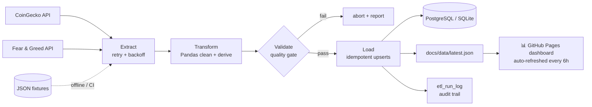

# DataFlow Mini ETL

**A practice data-engineering pipeline: public REST APIs → Pandas → PostgreSQL → live dashboard.**

[](https://prachyatmisra.github.io/Dataflow-Mini-Etl/)
[](https://github.com/PrachyatMisra/Dataflow-Mini-Etl/actions/workflows/ci.yml)
[](https://github.com/PrachyatMisra/Dataflow-Mini-Etl/actions/workflows/dashboard-refresh.yml)
[](https://www.python.org/)
[](LICENSE)

> Built by **[Prachyat Misra](https://github.com/PrachyatMisra)** — Junior Cybersecurity Engineer · AI/ML enthusiast

---

## 🎯 Live demo

**👉 Dashboard: [prachyatmisra.github.io/Dataflow-Mini-Etl](https://prachyatmisra.github.io/Dataflow-Mini-Etl/)**

The dashboard is plain static files served by GitHub Pages. A scheduled GitHub
Actions job runs this pipeline against the **real public APIs every 6 hours**
and commits a fresh `docs/data/latest.json`, so the hosted page shows live
market data with no server, no API keys and no cost.

## What is this?

A small but deliberately production-shaped ETL project, built as hands-on
practice of the fundamentals used in real data-engineering work:

| Stage | What happens | Technology |
|---|---|---|
| **Extract** | Pull data from public REST APIs with retry + exponential backoff + rate-limit handling | [CoinGecko](https://www.coingecko.com/en/api) market snapshot & 7-day price history, [alternative.me](https://alternative.me/crypto/fear-and-greed-index/) Fear & Greed Index |
| **Transform** | Type coercion, deduplication, normalization and derived metrics | Pandas |
| **Validate** | 8-check data-quality gate (schema, nulls, ranges, uniqueness, volume, freshness) that aborts the run on hard failures | custom checks with pass/warn/fail severity |
| **Load** | Idempotent upserts into a warehouse + CSV/JSON artifacts | PostgreSQL (Docker Compose) or SQLite (zero-setup fallback) |
| **Publish** | One JSON payload powers the GitHub Pages dashboard | Chart.js, vanilla JS |



## Features

- **Sequential, observable pipeline** — `extract → transform → validate → load → publish`, each stage timed and recorded in an `etl_run_log` audit table and in the dashboard itself.
- **Resilient extraction** — session reuse, timeouts, exponential backoff with jitter, `Retry-After`-aware 429 handling; trend-history failures are non-fatal.
- **Real data-quality gate** — 8 named checks with `pass / warn / fail` semantics and configurable tolerances; hard failures abort the load and exit with code 2.
- **Idempotent loads** — natural-key upserts (`run_id + coin_id`, `coin_id + day`, `snapshot_date`), so re-runs never duplicate data.
- **Two warehouse backends behind one interface** — PostgreSQL in Docker Compose, SQLite for zero-dependency local runs; `--backend none` for artifact-only runs (CI).
- **Offline replay mode** — committed API fixtures let the full pipeline run (and tests pass) with no network at all.
- **Containerized** — slim, non-root image; `docker compose up` brings up Postgres + pipeline (+ optional pgAdmin).
- **CI/CD** — lint (ruff) + 32 tests (pytest) on every push; scheduled job refreshes dashboard data every 6 hours.
- **12-factor configuration** — every knob overridable via environment / `.env` (`python -m etl show-config` prints the effective settings).

## Project structure

```
Dataflow-Mini-Etl/
├── etl/                      # the pipeline package (run with: python -m etl)
│   ├── config.py             #   env-driven settings + tiny .env loader
│   ├── log.py                #   structured console logging
│   ├── extract.py            #   API client (retry/backoff) + fixture replay
│   ├── transform.py          #   Pandas cleaning + derived metrics
│   ├── validate.py           #   data-quality gate (8 checks)
│   ├── load.py               #   Postgres/SQLite upserts + artifact export
│   ├── pipeline.py           #   orchestrator: stages, timing, exit codes
│   └── __main__.py           #   CLI entry point
├── tests/                    # 32 unit + end-to-end tests (offline)
│   └── fixtures/             # committed API payloads for replay/CI
├── docs/                     # GitHub Pages dashboard (static)
│   ├── index.html            #   dark-theme dashboard
│   ├── css/ · js/            #   styles + Chart.js renderer
│   └── data/latest.json      #   pipeline-generated payload (auto-refreshed)
├── .github/workflows/
│   ├── ci.yml                # lint + test + offline smoke run
│   └── dashboard-refresh.yml # 6-hourly live run → commits fresh dashboard data
├── Dockerfile                # slim non-root pipeline image
├── docker-compose.yml        # Postgres 16 + pipeline (+ pgAdmin profile)
├── Makefile                  # developer shortcuts
├── requirements.txt          # runtime deps (pandas, requests, psycopg2)
└── requirements-dev.txt      # + pytest, ruff
```

## Quickstart

### Option 1 — zero-setup local run (SQLite + artifacts)

```bash
python3 -m venv .venv && source .venv/bin/activate
pip install -r requirements-dev.txt

python -m etl run                  # live APIs -> SQLite (data/dataflow.db)
python -m etl run --source fixture # offline replay, no network needed
make dashboard                     # view the dashboard on http://localhost:8080
```

### Option 2 — full containerized stack (PostgreSQL)

```bash
docker compose up --build                  # Postgres 16 + one pipeline run
docker compose --profile tools up -d       # also pgAdmin on http://localhost:5050
docker compose run --rm etl                # re-run the pipeline on demand

# inspect the warehouse
docker compose exec db psql -U etl -d dataflow -c "SELECT * FROM etl_run_log;"
```

### Useful commands

```bash
python -m etl run --backend postgres        # force PostgreSQL (needs DATABASE_URL)
python -m etl run --backend none            # artifacts only (no warehouse)
python -m etl run --limit 50 --log-level DEBUG
python -m etl show-config                   # print effective configuration
make test lint                              # pytest + ruff
```

## Configuration

Everything is optional — sane defaults apply. Set via environment or `.env`
(see [.env.example](.env.example)).

| Variable | Default | Purpose |
|---|---|---|
| `DATABASE_URL` | *(empty → SQLite)* | PostgreSQL connection string |
| `SQLITE_PATH` | `data/dataflow.db` | SQLite fallback location |
| `MARKET_LIMIT` | `25` | coins pulled from the markets endpoint |
| `TREND_COIN_COUNT` / `TREND_DAYS` | `5` / `7` | price-history series for the trend chart |
| `FEAR_GREED_DAYS` | `30` | sentiment history length |
| `HTTP_TIMEOUT_SECONDS` / `HTTP_MAX_RETRIES` / `HTTP_BACKOFF_SECONDS` | `20` / `4` / `1.5` | extraction resilience |
| `MIN_ROWS` / `FRESHNESS_MAX_HOURS` / `NULL_TOLERANCE_PCT` | `10` / `24` / `5` | quality-gate thresholds |
| `SOURCE_MODE` | `api` | `api` = live, `fixture` = offline replay |
| `EXPORT_DIR` | `docs/data` | dashboard payload destination |
| `LOG_LEVEL` | `INFO` | `DEBUG` for full detail |

## Data model

| Table | Key | Contents |
|---|---|---|
| `coins_snapshot` | `(run_id, coin_id)` | one row per coin per run: price, cap, volume, supplies, ATH, derived metrics |
| `price_history` | `(coin_id, ts)` | daily close for trend coins (UTC day granularity) |
| `fear_greed` | `snapshot_date` | daily sentiment 0–100 + classification |
| `etl_run_log` | `run_id` | audit trail: status, row counts, stage timings, validation report |

Derived metrics computed in the transform stage: `volume_to_mcap_ratio`,
`market_share_pct`, `momentum_bucket`, `is_stablecoin`, plus base-100 indexed
7-day trend series for the dashboard.

## Data-quality gate

| Check | Fails when |
|---|---|
| `schema.columns` | canonical columns missing after transform |
| `nulls.critical` | any null in id / price / market-cap / rank |
| `nulls.secondary` | null cells in secondary columns exceed `NULL_TOLERANCE_PCT` |
| `ranges.values` | non-positive prices, negative caps, implausible % changes |
| `keys.unique_coin_id` | duplicate coins in a snapshot |
| `volume.row_count` | fewer rows than `MIN_ROWS` |
| `freshness.source` | source timestamps older than `FRESHNESS_MAX_HOURS` (warn-only for fixture replays) |
| `fear_greed.range` | sentiment values outside 0–100 |

## Testing & CI

```bash
make test    # 32 tests: transforms, every validation check, and a full
             # offline end-to-end run incl. idempotency + artifact assertions
make lint    # ruff
```

Every push runs lint + tests on Python 3.11 and 3.12, plus an offline pipeline
smoke run. The dashboard data on `main` is refreshed by the scheduled
workflow every 6 hours.

## Project assessment & roadmap

**Current level:** intermediate, portfolio-ready. Beyond the classic
“fetch → clean → load” exercise it demonstrates retry semantics, a real
quality gate, idempotent upserts, audit logging, dual backends, CI and
self-updating static hosting — the concerns that separate toy scripts from
pipelines.

Ideas for the next iteration:

- [ ] Incremental loads with a slowly-changing-dimension table for coins
- [ ] dbt models on top of the raw snapshots
- [ ] Great Expectations alongside the built-in checks
- [ ] Airflow/Prefect orchestration instead of cron
- [ ] Grafana dashboards reading straight from PostgreSQL

## Credits & license

Designed and built by **Prachyat Misra** as a self-learning project in ETL
fundamentals, data modeling and containerized workflows.
Market data by [CoinGecko](https://www.coingecko.com/en/api); sentiment by
[alternative.me](https://alternative.me/crypto/fear-and-greed-index/).
Educational project — not financial advice.

Released under the [MIT License](LICENSE).
